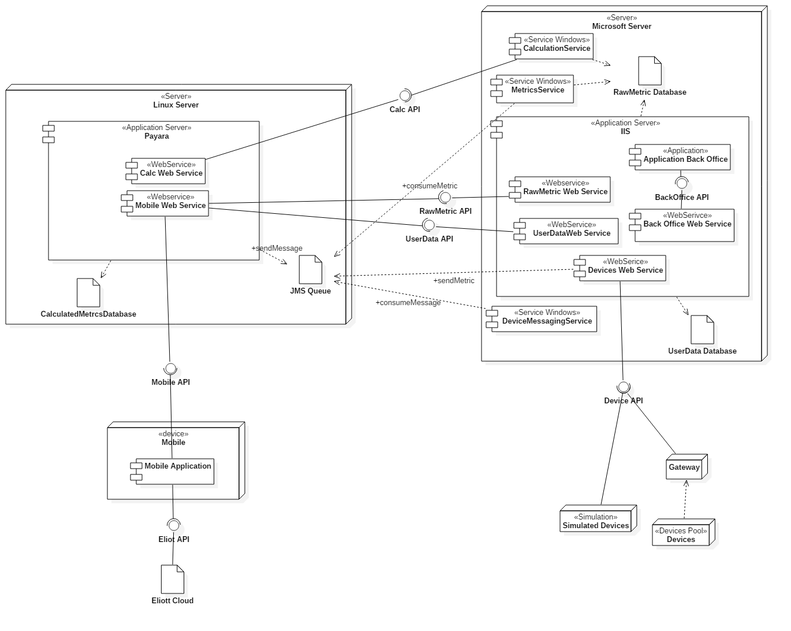
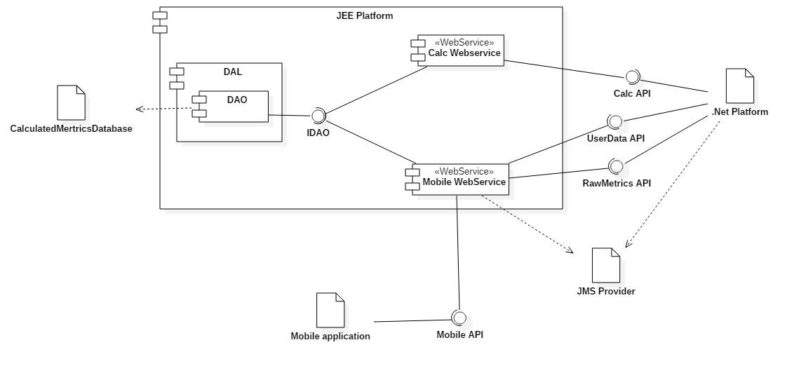
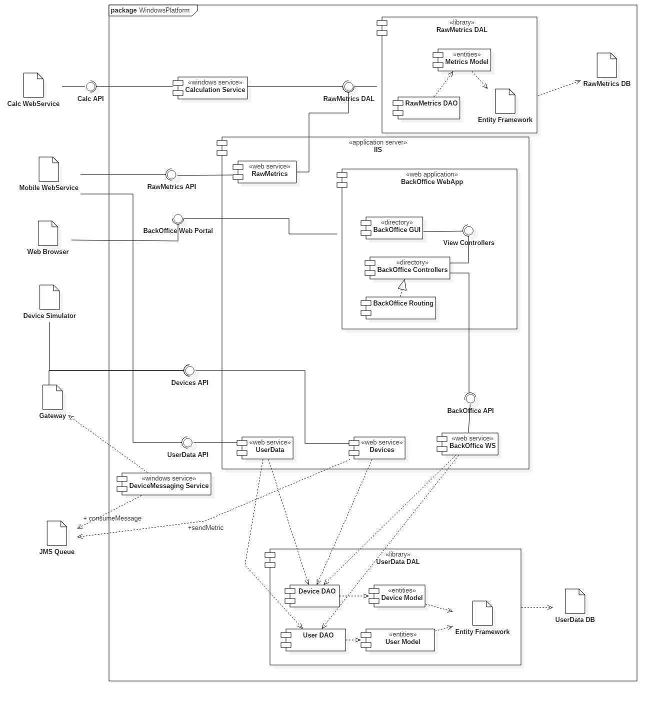
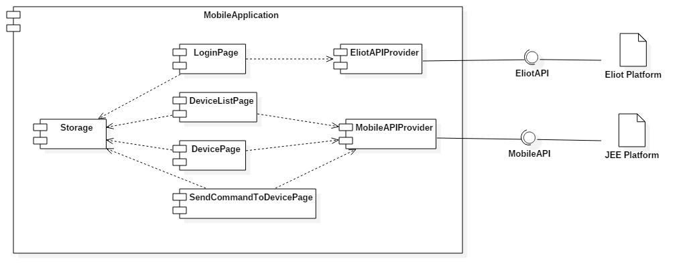
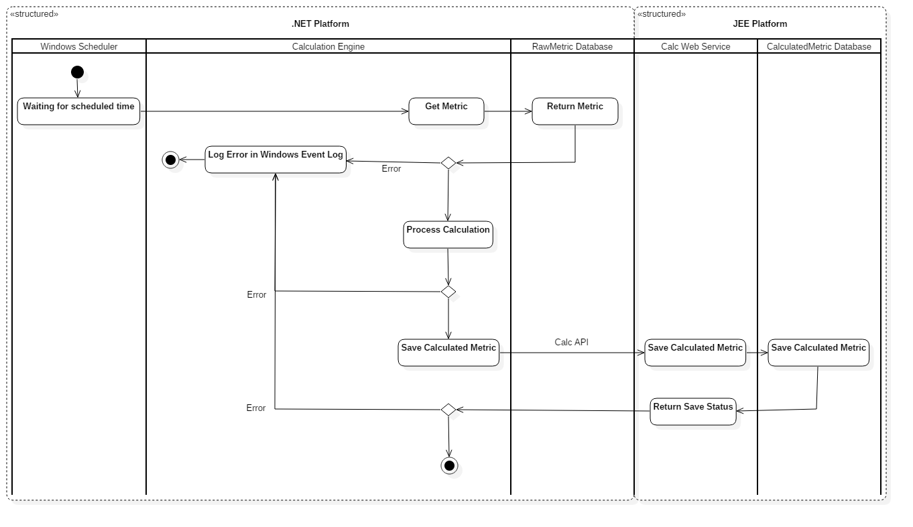
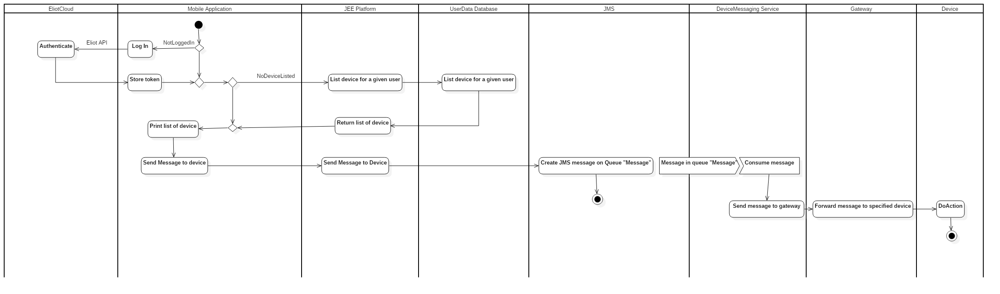
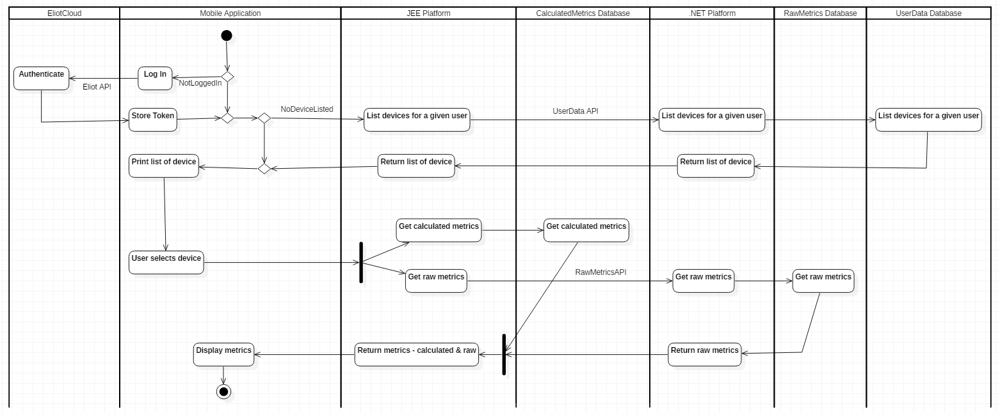

# AtlantisToulouseUML

### DeploymentDiagram

### ComponentJEEDiagram

### WindowsPlatform_ComponentDiagram

### MobileApplicationComponentDiagram

### ActivityDiagram_CalculationEngineFlow

This diagram represents the flow generated by the Calculation Engine.

Calculation will be triggered periodically using the **Windows Scheduler**.

The latest Raw Metrics will be retrieved. Then calculations will be processed according to **pre-defined rules**.

Then measured values will be saved on the **CalculatedMetrics database** using the Calc Web Service.

In case of an error in any step of the processus, the Calculation Engine will log the error in the **Windows Event Log** before stopping.

### ActivityDiagram_SendMessageToDevice

### ActivityDiagram_DisplayMetricOnAndroidApplication

